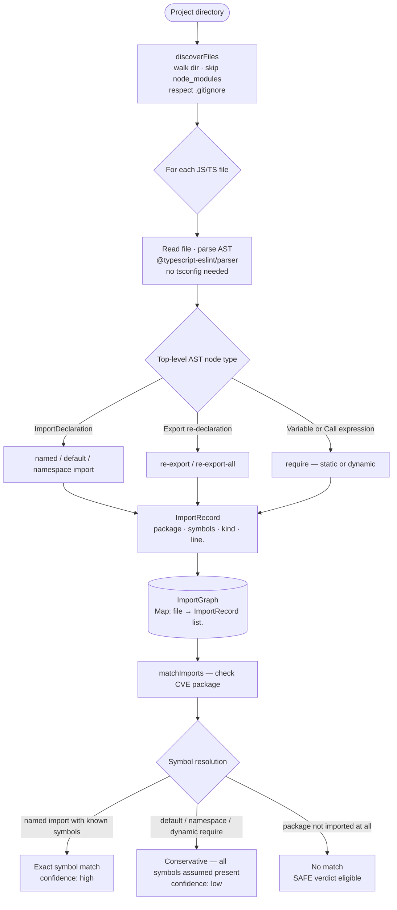
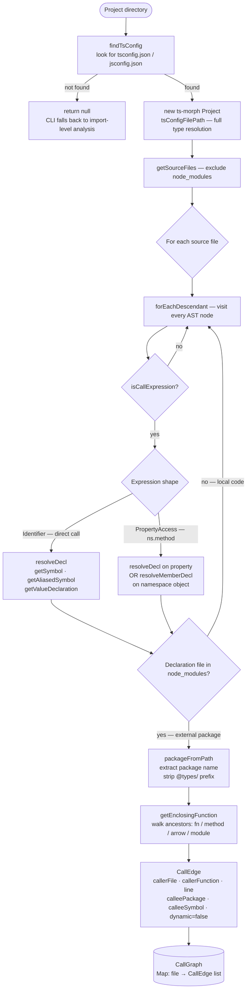
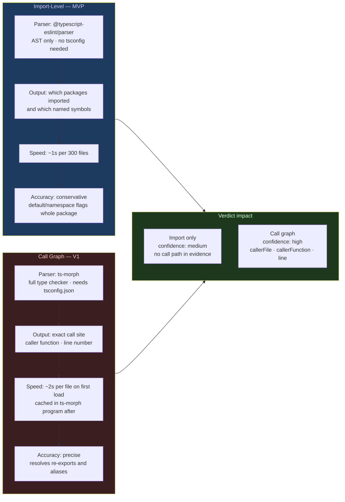
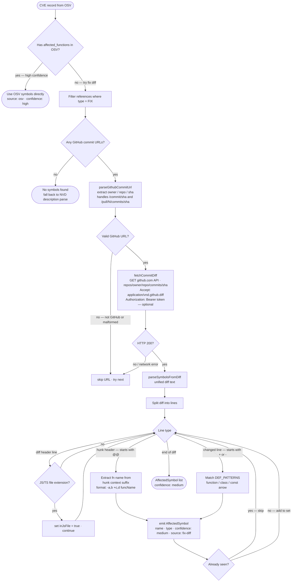
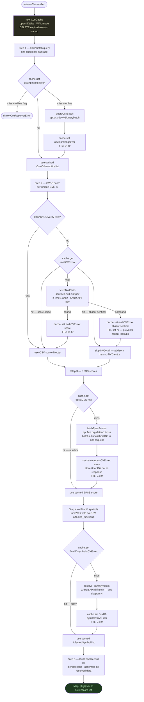

# Reachble — Architecture Diagrams

Four diagrams covering the two static analysis approaches, fix-commit diff symbol extraction, and the CVE cache layer.

---

## 1. Import-Level Analysis

Operates on file text only — no type checker, no `tsconfig.json` needed.
Parser: `@typescript-eslint/parser` (AST only, ~10–40 ms per file).

**What gets flagged conservative (lower confidence):**

| Import form | Example | Why conservative |
|---|---|---|
| Default import | `import _ from 'lodash'` | Can't tell which methods are used |
| Namespace import | `import * as pkg from 'x'` | All exports potentially used |
| Dynamic require | `require(variable)` | Package unknown at parse time |
| `export *` | `export * from 'x'` | All symbols re-exported |

---

## 2. Call Graph Analysis

Uses ts-morph (TypeScript compiler API) — requires `tsconfig.json`, resolves types precisely.
Cost: 500–2000 ms per file on first load (full type checker initialization).

---

## 3. Import vs Call Graph — Approach Comparison

| | Import-level | Call graph |
|---|---|---|
| Requires `tsconfig.json` | No | Yes |
| Startup cost | ~50 ms | ~1–3 s (type checker init) |
| Per-file cost | ~10–40 ms | ~500–2000 ms |
| False positive rate | Higher (conservative imports) | Lower (exact resolution) |
| Identifies caller function | No | Yes |
| Identifies call-site line | Import line only | Exact call line |
| Follows re-exports / aliases | No | Yes |
| Dynamic call edges | Detected, flagged dynamic | Static calls are dynamic=false |

---

## 4. Fix-Commit Diff Symbol Extraction

Runs when a CVE has no `affected_functions` in its OSV record.
Hits the **original OSS repo** via GitHub API — no fork needed.

**Rate limits:**

| Mode | GitHub API limit | p-limit concurrency |
|---|---|---|
| No token | 60 req/hr | 2 concurrent |
| With `GITHUB_TOKEN` | 5,000 req/hr | 5 concurrent |

---

## 5. CVE Cache Layer

SQLite via `better-sqlite3` (synchronous, no daemon). Location: `~/.cache/reachble/cve-cache.db`.

**Cache key schema:**

| Prefix | Key example | What is stored | TTL |
|---|---|---|---|
| `osv:npm:` | `osv:npm:lodash@4.17.20` | OSV vulnerability list | 24 hr |
| `nvd:` | `nvd:CVE-2021-23337` | CVSS score object or `__absent__` sentinel | 24 hr |
| `epss:` | `epss:CVE-2021-23337` | Number 0–1 exploit probability | 24 hr |
| `fix-diff-symbols:` | `fix-diff-symbols:CVE-2021-23337` | AffectedSymbol list | 24 hr |

The `__absent__` sentinel for NVD prevents re-fetching GHSA-only advisories that NVD will never have a record for — a common case with GitHub Security Advisories.
